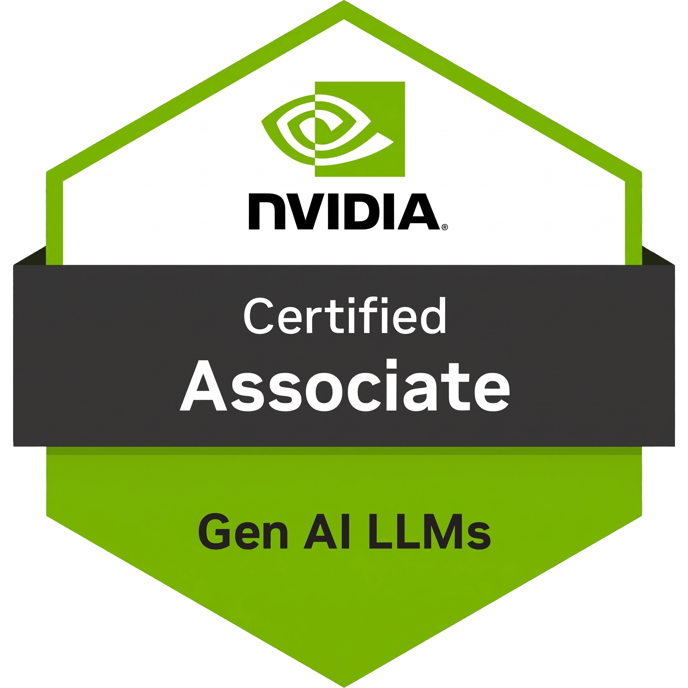
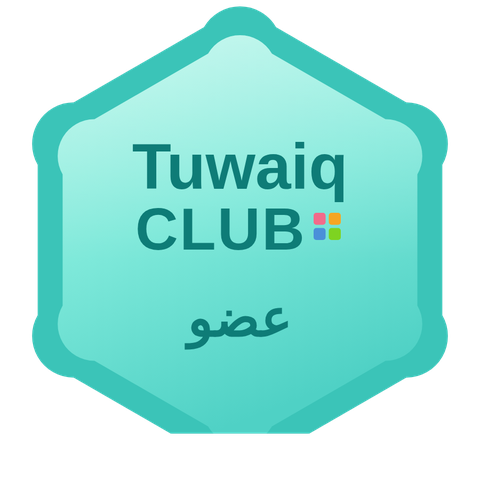

<h1 align="center">Khalid Al Dosari</h1>

  <strong>AI Engineer</strong> 
  LLMs and Agentic Systems

  
  
  
  

  
  
  
  

---

## About

NVIDIA-Certified Associate for Generative AI LLMs (NCA-GENL), senior Computer Science student, and Tuwaiq Academy alumnus specializing in AI Engineering, MLOps, and agentic systems.

I build end to end: autonomous multi-agent pipelines, fine-tuned ML workflows, and the full-stack applications that put them in front of users. My focus is architecting scalable, production-ready AI systems that turn raw data into deployed products.

---

## Featured Projects

| Project | Overview | Stack |
| :--- | :--- | :--- |
| **[Namtheg](https://github.com/khaliddosari/AutoML)** | Agentic AutoML platform running an autonomous 7-step pipeline that benchmarks 10 models across regression and classification in under 5 minutes. Serves zero-cold-start inference APIs from Modal cloud volumes while holding LLM cost under $0.50 per 50K tokens per run. | `LangChain` `FastAPI` `Next.js` `Modal` |

---

## Tech Stack

**AI and Machine Learning**
`LLMs` `Agentic Workflows` `RAG` `Deep Learning` `Transformers` `NLP` `Computer Vision` `CNNs` `RNNs` `Reinforcement Learning` `MLOps` `Prompt Engineering`

**Full-Stack Engineering**
`Python` `Java` `JavaScript` `TypeScript` `FastAPI` `Next.js` `React` `Spring Boot` `Maven` `REST APIs` `Tailwind CSS` `HTML/CSS` `Git` `Docker`

**Data and Cloud Infrastructure**
`PostgreSQL` `MongoDB` `MySQL` `Modal`