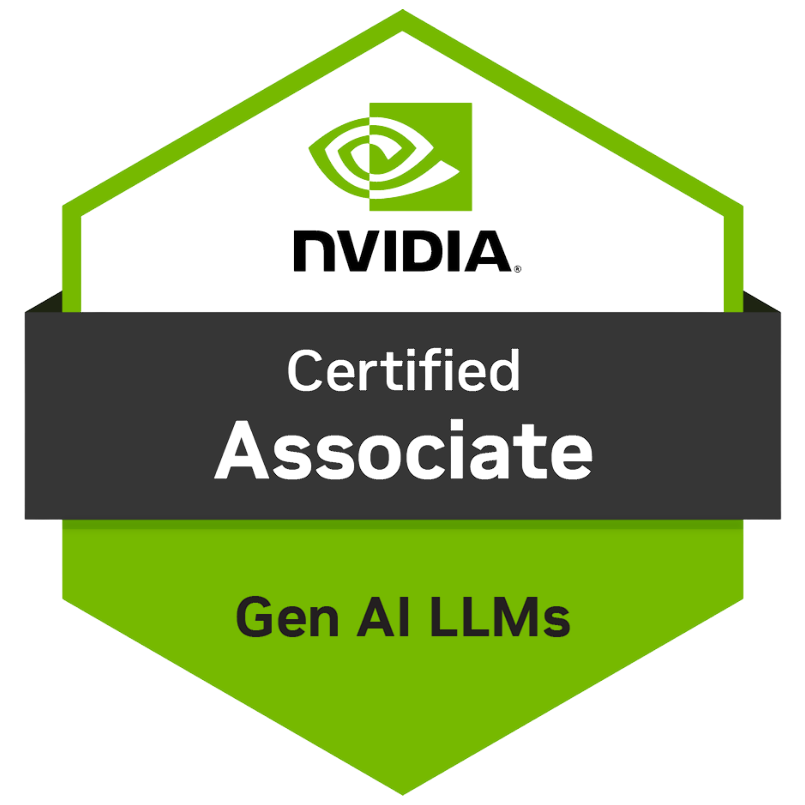
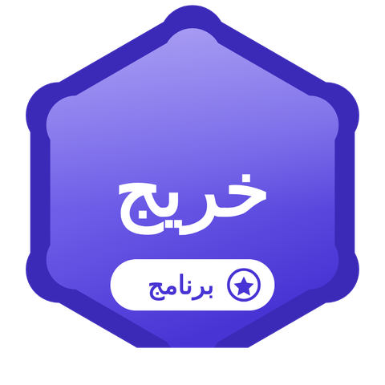
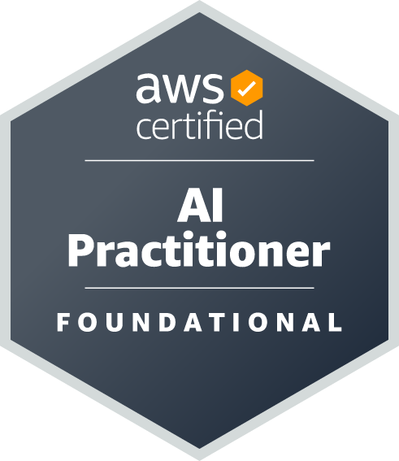

<h1 align="center">Khalid Al Dosari</h1>

  <strong>AI Engineer | Data Scientist</strong> 
  LLMs and Agentic Systems

  
  
  
  

  
  
  
  

---

## About

Senior Computer Science student focusing on AI engineering and data science, with strong skills in product
engineering. Passed the Tuwaiq Academy bootcamp in building and developing AI models, with over 200 hours of
hands-on experience and weekly deliverables. Worked on several technical projects spanning software engineering,
data science, AI engineering, and agentic workflows. Holds professional certifications such as NVIDIA-Certified
Associate: Generative AI LLMs (NCA-GENL) and AWS Certified AI Practitioner.

---

## Featured Projects

| Project | Overview | Stack |
| :--- | :--- | :--- |
| **[Raqeeb](https://github.com/khaliddosari/Raqeeb)**   Computer Vision Based Voice Agent | Spots prohibited items on X-ray belts and calls the authority. 92% mAP50. | `YOLOv8s-OBB` `Computer Vision` `Voice Agent` |
| **[Namtheg](https://github.com/khaliddosari/Namtheg)**   Automated Machine Learning | Sandboxed agent runs EDA and trains 13 GPU-accelerated models. | `LangChain` `FastAPI` `Next.js` `Modal` |
| **[Neurotrast](https://github.com/khaliddosari/Neurotrast-Tuwaiq)**   Dense Network vs CNN on CIFAR-10 | Dense net from scratch: 59% accuracy. Fine-tuned MobileNetV2: 91%. | `Deep Learning` `CNNs` `MobileNetV2` |
| **Thaheen** (in progress)   EEG-to-Image Reconstruction | Graduation project. Cuts EEG sensors by 84% (128 to 20). | `DreamDiffusion` `ViT-Large` `CLIP` `EEG` |
| **Nahj** (in progress)   Agentic Elective Course & Prerequisite Engine | 3 agentic pipelines recommend each student's top 5 electives. | `Agentic Pipelines` |

---

## Skills & Tools

**AI & Machine Learning**
`Data Science` `Machine Learning` `Deep Learning` `Computer Vision` `CNNs` `NLP` `Transformers` `MLOps` `LLMs` `RAG` `Agents` `Prompt Engineering`

**Programming**
`Python` `Java` `SQL` `JavaScript` `TypeScript`

**Tools & Frameworks**
`Git` `GitHub` `NumPy` `Pandas` `Matplotlib` `Seaborn` `Scikit-learn` `PyTorch` `LangChain` `LangGraph` `FastAPI` `REST APIs`

**Cloud & Databases**
`SQLite` `PostgreSQL` `MongoDB` `MySQL` `Cloudflare` `Modal` `AWS` `Docker` `Firecracker` `Coolify`

**Soft Skills**
`Leadership` `Problem Solving` `Project Management` `Communication Skills` `Teamwork`

**Languages**
`Arabic` `English`

---

## Professional Certificates

<table width="100%">
  <thead>
    <tr>
      <th align="left" width="70%">Certificate</th>
      <th align="left" width="30%">Issuer</th>
    </tr>
  </thead>
  <tbody>
    <tr>
      <td><strong><a href="https://khalid-ai.dev">AWS Certified AI Practitioner</a></strong></td>
      <td>AWS</td>
    </tr>
    <tr>
      <td><strong><a href="https://www.credly.com/badges/c9f84e34-32e5-4e67-8fe8-9fcf2ae50d1d/public_url">NVIDIA-Certified Associate: Generative AI LLMs</a></strong></td>
      <td>NVIDIA</td>
    </tr>
    <tr>
      <td><strong><a href="https://khalid-ai.dev/assets/certifications/dz4OvNY.pdf">Building and Developing AI Models Bootcamp</a></strong></td>
      <td>Tuwaiq Academy</td>
    </tr>
    <tr>
      <td><strong><a href="https://khalid-ai.dev/assets/certifications/g4PND8k.pdf">Building Transformer-Based NLP Applications</a></strong></td>
      <td>Tuwaiq Academy</td>
    </tr>
  </tbody>
</table>
